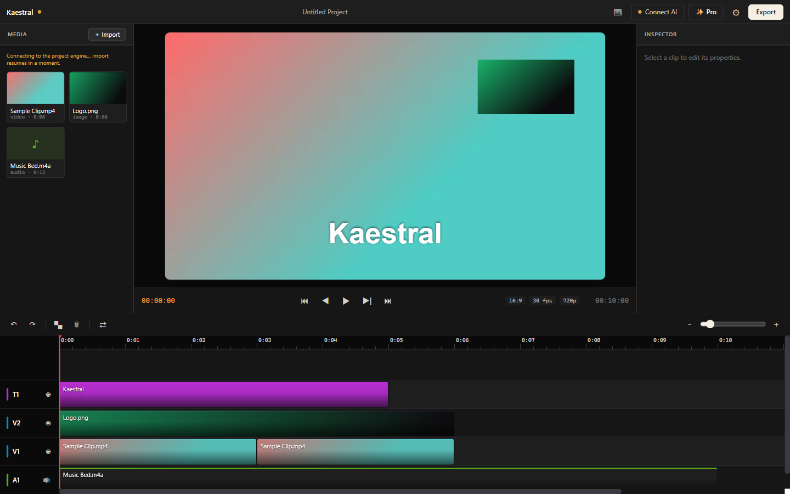

<p align="center">
  
</p>

<h1 align="center">Kaestral</h1>

<p align="center"><strong>The AI-operated video editor for Windows. You describe the edit. It makes it.</strong></p>

<p align="center">
  <a href="https://github.com/prabindersinghh/Kaestral-pro/releases/latest"></a>
  
  
  
</p>

---

A kestrel watches with total precision, then strikes. Kaestral watches your footage, hears every
word, and cuts. Type *"cut the boring parts, add captions, punch in on the hook"* — and watch your
timeline change.

Works with the **Claude Code** you already have (free), or in-app chat. Built on a real pro timeline —
so when the AI is done, you can still touch every frame. **Everything runs locally — your video never
leaves your machine.**

<p align="center">
  
</p>

---

## Quick start

The fastest way in is to point the Claude Code you already have at Kaestral — **one command, zero config:**

```bash
claude mcp add kaestral -- npx kaestral
claude
```

Claude Code spawns `npx kaestral` itself and talks to it over stdio (an MCP server) — no separate
process, no port to remember. Then just ask:

> *"get_timeline, then cut the silent parts of demo.mp4, add captions, and export it."*

Prefer the full desktop app? **[Download for Windows →](https://github.com/prabindersinghh/Kaestral-pro/releases/latest)** — double-click the installer, the editor and its engine start internally (no terminal, no npm).

---

## What it does

### 🎬 AI-operated. You direct, it edits.
Describe the edit in plain language and watch it happen on your timeline — cut, caption, punch in,
grade, add a title. Every action runs through the editor's tools, so the result is a real, editable
project, not a black-box export. Drive it with **Claude Code** (free, terminal) or the **in-app chat**.

### ⚡ Raw footage → publish-ready reel.
Drop a 20-minute recording; get a tight, captioned, beat-cut short. Kaestral **removes filler words**,
**finds the hook**, and **captions on the word** — automatically. Speech is transcribed on-device; cuts
land on silences and beats.

### 📊 Make SaaS & product videos without an editor.
Animated intros, logo reveals, data-viz, transition stingers — **art-directed from a sentence** and
rendered onto your timeline. Not templates: a connected LLM composes bespoke motion using the
`compose_motion` surface + a master motion-designer skill. Launch videos, demos, and ads, without
hiring an editor.

*…plus the full editor underneath:*

- **Real pro timeline** — multi-track, ruler + playhead, drag-with-snapping, split, ripple-delete,
  undo/redo, keyframes, 16 blend modes, frame-accurate composited preview.
- **Perception** — word-level transcription (whisper, on-device), frame **vision** (the AI actually
  sees your footage), beat/silence detection, color-palette extraction.
- **Motion graphics** — bespoke, art-directed compositions (`compose_motion`) + fast canvas titles.
- **Color** — grade with wheels, curves, LUTs, temperature.
- **Import from anywhere** — files, drag-drop, or a URL (`import_from_url`, via your `yt-dlp`).
- **Export** — H.264 / H.265 / ProRes, plus **Premiere (XMEML)** and **Resolve/FCP (FCPXML)**.
- **Editing playbooks (skills)** — art-direction, viral-reel, beat-sync, creative-director, captions,
  b-roll, platform-delivery, promo/ad. The AI reads them and follows pro workflows.

**50 MCP tools.** A full editor the AI operates like a pair of hands. Full reference:
[docs/MCP-TOOLS.md](./docs/MCP-TOOLS.md).

---

## How it works (the proof)

On-device **whisper** for word-level transcription · **frame vision** so the model sees the footage ·
**beat/silence detection** for rhythmic cuts · **palette extraction** for on-brand color · **Remotion**
motion graphics · an **MCP server** exposing 50 tools over stdio (or HTTP) · a full multi-track
timeline · **H.264/H.265/ProRes** render + **Premiere/Resolve** interchange export.
**No cloud required for any of it — nothing is uploaded.**

---

## Connect an AI

### Option A — Claude Code (free, one command)
```bash
claude mcp add kaestral -- npx kaestral
claude
```
Prefer running the engine yourself (e.g. to keep it up across multiple `claude` sessions)? Use the
HTTP transport instead:
```bash
npx kaestral --http     # starts the local editor engine on http://127.0.0.1:19789/mcp
claude mcp add --transport http kaestral http://127.0.0.1:19789/mcp
claude
```

### Option B — In-app chat (your own Anthropic key)
Open the desktop app → **Connect AI** → paste your key. Chat right inside Kaestral; edits happen live
in the window.

> **Prerequisites:** Node/npm (for `npx kaestral`) and **FFmpeg + ffprobe** on your PATH. The whisper
> transcription model (~142 MB) downloads on first use. The Windows installer bundles everything, so
> the app itself needs none of this.

---

## Install options

| | How |
|---|---|
| **MCP (recommended)** | `claude mcp add kaestral -- npx kaestral` |
| **Windows installer** | [Download the latest release](https://github.com/prabindersinghh/Kaestral-pro/releases/latest) → double-click |
| **From source** | `git clone https://github.com/prabindersinghh/Kaestral-pro && cd Kaestral-pro && npm install && npm run tauri dev` |
| **macOS** | On the roadmap — Kaestral is Windows-first by design (that's the wedge). |

---

## What makes it different

| | **Kaestral** |
|---|---|
| Platform | **Windows** (macOS on roadmap) |
| AI editing over MCP | ✅ drive it from the Claude Code you already have — one command |
| Perception (transcribe / see / beats) | ✅ on-device |
| Bespoke motion graphics | ✅ art-directed by the LLM, not templates |
| Real timeline | ✅ multi-track, keyframes, blend modes — a true editable project |
| Privacy | ✅ 100% local — nothing uploaded |
| AI video **generation** | ⏳ Pro (waitlist) |
| Price | free, GPLv3 |

Kaestral's edge is **Windows + real perception + bespoke AI motion + a free, open, Claude-Code-native
workflow, all running locally.** Generation lands later, in the Pro tier.

---

## Pro & Max (waitlist)

- **Pro — coming soon:** AI video & image **generation** (prompt → a real clip on your timeline),
  translation & **dubbing** (Hindi + regional Indian languages, and beyond), temporally-consistent
  **upscaling**, advanced generative motion (PixiJS particles & shaders).
- **Max —** something bigger. Details under wraps.

Join from the app's **✨ Pro** button, or the [pricing page](https://kaestral.com/pricing.html). Basic
is free and open source, forever; Pro/Max pricing is announced closer to launch.

---

## Privacy — local-first

Your video and project files stay on your device. Kaestral never uploads them. Transcription (whisper),
frame vision, beat detection, and rendering all run **locally**. The only things that ever leave your
machine: your **AI prompts** (sent to Anthropic, only if you use in-app chat with your own key), and
your **email** (only if you join the Pro/Max waitlist). No account required.

---

## Development

```bash
npm test           # full suite: format round-trip, edit engine, MCP contract, perception, render
npm run typecheck  # strict TS  (tsc --noEmit)
npm run build      # production frontend
npm run tauri dev  # run the desktop app
npm run tauri build  # build the Windows installer (see docs/UPDATER-SETUP.md for signed releases)
```

Docs worth reading before you dig in:
- [docs/MCP-TOOLS.md](./docs/MCP-TOOLS.md) — the 50-tool reference.
- [docs/ARCHITECTURE.md](./docs/ARCHITECTURE.md) — how the pieces fit (editor = hands, LLM = brain).
- [docs/LAUNCH-RUNBOOK.md](./docs/LAUNCH-RUNBOOK.md) — build, publish, and deploy steps.
- [FUTURE-IDEAS.md](./FUTURE-IDEAS.md) — deferred post-1.0 work.

---

## License & credit

**GPLv3.** Kaestral is a derivative work of the upstream **Palmier Pro** by Palmier Inc.
([palmier-io/palmier-pro](https://github.com/palmier-io/palmier-pro), GPLv3), re-implemented for
Windows using the Swift source as an executable specification. This attribution is required by the
GPLv3 and is retained accordingly; Kaestral is not affiliated with or endorsed by Palmier Inc. The
upstream's proprietary cloud generation backend is not part of that repo and is not ported.
Third-party components (whisper.cpp, FFmpeg, Remotion, etc.) retain their own permissive licenses —
see [NOTICE.md](./NOTICE.md).
